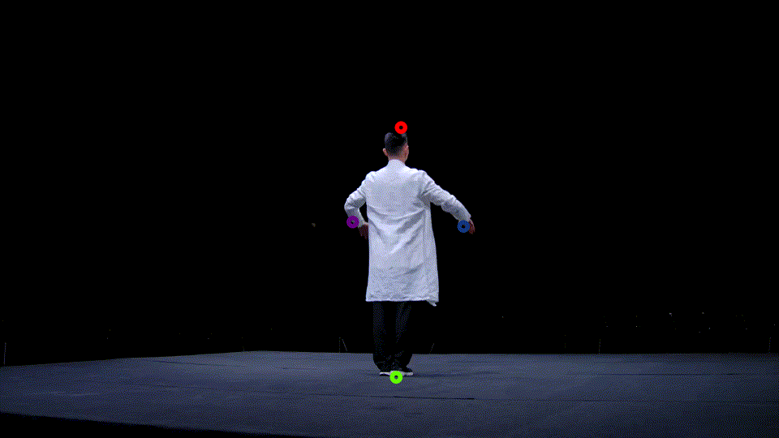

# CamLab
## play with camera pose

```sh
pip install camlab
```

<p float="center">
  
</p>

project a world-coordinate point to screen coordniate:

```python
import numpy as np
from camlab import CameraObj


cam = CameraObj()

# init intrinsics
focal = 1111.1
w = 800
h = 800
cam.manual_init(focal, w, h)

# init extrinsics
extri = np.array(
        [[-9.9990e-01,  4.1922e-03, -1.3346e-02, -5.3798e-02],
        [-1.3989e-02, -2.9966e-01,  9.5394e-01,  3.8455e+00],
        [-4.6566e-10,  9.5404e-01,  2.9969e-01,  1.2081e+00],
        [0.0, 0.0, 0.0, 1.0]])
cam.load_extrinsic(extri)

# coordinates transformation
p_in_world = [0, 0, 0]
p_in_screen = cam.world2screen(p_in_world, to_int=True)
print(p_in_screen)
# [400, 400]

```

make a ray from a screen point:

```python
import numpy as np
from camlab import CameraObj

intri = [[1111.0, 0.0, 400.0],
         [0.0, 1111.0, 400.0],
         [0.0, 0.0, 1.0]]
extri = np.array(
        [[-9.9990e-01,  4.1922e-03, -1.3346e-02, -5.3798e-02],
        [-1.3989e-02, -2.9966e-01,  9.5394e-01,  3.8455e+00],
        [-4.6566e-10,  9.5404e-01,  2.9969e-01,  1.2081e+00],
        [0.0, 0.0, 0.0, 1.0]])

cam_obj = CameraObj(intri)
cam_obj.load_extrinsic(extri)

p = (400, 400)  # screen point
rayo, rayd = cam_obj.make_ray(p)
print(rayo, rayd)
# ray origin and ray direction
# (rayd - rayo) represents a point at the ray.
p_ = cam_obj.world2screen(rayd - rayo, to_int=True)
# reproject the ray point to screen
print(p_)
# (400, 400)

``` 

